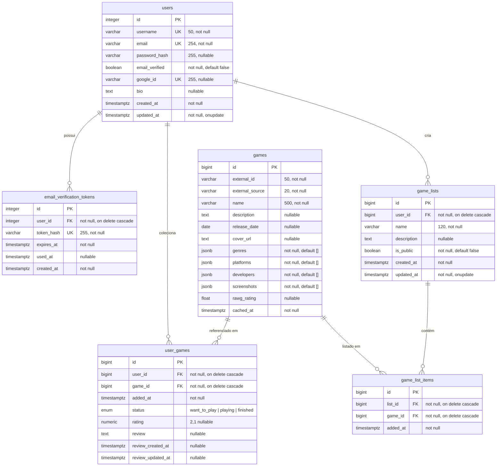

# Diagrama ER — Banco de Dados (estado atual)

Diagrama gerado a partir dos modelos SQLAlchemy e migrations Alembic do `backend/`.
Cole o bloco abaixo no [Mermaid Live Editor](https://mermaid.live) ou visualize direto no GitHub.

## Restrições de unicidade

| Tabela | Constraint | Colunas |
| --- | --- | --- |
| `users` | unique | `username`, `email`, `google_id` (individuais) |
| `email_verification_tokens` | unique | `token_hash` |
| `games` | `uq_games_external` | (`external_source`, `external_id`) |
| `user_games` | `uq_user_games_user_game` | (`user_id`, `game_id`) |
| `game_list_items` | `uq_game_list_items_list_game` | (`list_id`, `game_id`) |

## Índices adicionais

- `ix_user_games_user_id` em `user_games(user_id)`
- `ix_game_lists_user_id` em `game_lists(user_id)`
- `ix_game_list_items_list_id` em `game_list_items(list_id)`

## Observações

- Todas as FKs usam `ON DELETE CASCADE`: apagar um usuário remove seus tokens, jogos coletados e listas; apagar uma lista remove seus itens.
- `games` funciona como **cache** do provedor externo (RAWG): identificado por (`external_source`, `external_id`) e revalidado via `cached_at`.
- `user_games` concentra a relação usuário↔jogo — status na coleção, nota (`rating`) e review no mesmo registro (um por par usuário/jogo).
- Tipos `timestamptz` = `DateTime(timezone=True)`; `enum status` = tipo Postgres `user_game_status`.
</content>
</invoke>
